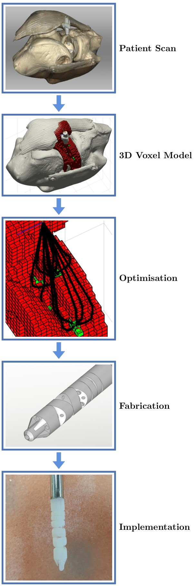

# DesignAlgorithm_SnakeRaven

Automated end-to-end design optimisation for patient-specific snake-like surgical manipulators, searching over dexterity, reachability and task-space obstacles to generate a bespoke 3D-printable design from a patient scan.

**Status:** archived. Research code as published in 2022, not actively maintained. Developed against MATLAB R2018b.

## Paper

This is the companion code for:

> A. Razjigaev, A. K. Pandey, D. Howard, J. Roberts and L. Wu, "End-to-End Design of Bespoke, Dexterous Snake-Like Surgical Robots: A Case Study With the RAVEN II," *IEEE Transactions on Robotics*, vol. 38, no. 5, pp. 2827–2840, 2022. [doi:10.1109/TRO.2022.3164841](https://doi.org/10.1109/TRO.2022.3164841)

Full method and derivations: [PhD thesis](https://eprints.qut.edu.au/235042/). A recorded talk on the paper is [here](https://www.youtube.com/watch?v=MVYZSw9YFQw).



## What this implements

The pipeline takes an anatomical STL and returns a manipulator design — module lengths, curvature and joint parameters — optimised for that anatomy. The case study in the paper targets a knee, for arthroscopy.

- **Differential Evolution** (DE/rand/1/bin), written from scratch, searching a design space of roughly 10¹² candidates.
- **A Monte Carlo fitness function** sampling the workspace, with a two-stage forward-kinematics gate to reject infeasible candidates cheaply before the expensive evaluation.
- **A voxelised task-space representation** with morphologically dilated obstacles, an Obstacle Occlusion Index, and a service-sphere SO(3) coverage metric for orientation dexterity.
- **HPC deployment** as long-running PBS jobs with per-generation checkpointing and a resume path.

## Reproducing the results

### Requirements

- MATLAB with the **Parallel Computing Toolbox**. Developed against R2018b.
- A machine with real core count, or an HPC allocation. See the note on runtime below.

### 1. Anatomy scan

You need an STL of the target anatomy. The one used in the paper is a **phantom knee**, captured with an Artec 3D scanner — the same phantom used in the hardware experiments, so the design results and the physical validation share a geometry.

**Download:** [kneemodel.stl](https://www.dropbox.com/s/bmo72qa6k2d3a8v/kneemodel.stl?dl=0) (47.6 MB, units in **millimetres**). It is too large to sit in this repository.

Any watertight anatomical STL will work in its place; the voxelisation step below is what the optimiser actually consumes.

<!-- STATE OF PLAY, 2026-09-07. This section is publishable as written — the link
     works and the file is now described rather than merely linked. What follows is
     the upgrade path, not a blocker.

     WHY IT WAS NOT COMMITTED: Andrew tried and GitHub rejected it. That was the WEB
     UPLOAD interface, which caps at 25 MB — not a repository limit. Via git push the
     ceiling is 100 MB per file, with a warning above 50 MiB, and at 47.68 MiB this
     file clears both. So committing it IS possible from the command line.

     IT STILL SHOULD NOT BE. Three reasons, and they outlive the size question:
     - Git stores every version forever. A 47.6 MB binary makes every clone of this
       repo carry 47.6 MB permanently, including for the many people who only want to
       read the MATLAB.
     - Binary STLs do not diff or compress between versions, so a re-scan doubles it.
     - It gets no DOI, so nobody can cite the dataset independently of the code.

     Git LFS solves the first two and not the third, and adds a quota and a
     dependency for anyone cloning.

     RECOMMENDED UPGRADE: Zenodo. Free, 50 GB per record so 47.6 MB is nothing,
     gives a citable DOI, versioned, permanent, and it is what a reviewer or a
     reproducing group expects for data attached to a published paper. Roughly half
     an hour. Then this section becomes a DOI and the Dropbox link retires.

     The Dropbox link is not urgent — it works, it is Andrew's own account, and it is
     now documented well enough that someone could substitute their own scan if it
     ever dies. It is simply the weakest link in a chain whose other links are strong.

     STILL NEEDED, and it is small: the STL's UNITS. Artec exports are typically
     millimetres but that is not something to state without checking, and a silent
     mm/m mismatch is a classic way to lose an afternoon. One line here once known. -->

<!-- Units confirmed mm by Andrew 2026-09-07. -->


### 2. Voxelisation

```matlab
GenerateVoxelisation.m
```

Produces a voxel map. The example output is `VoxelDataMultiTarget.mat`; your run will carry the date in the filename instead.

### 3. Optimisation

```matlab
SnakeRaven_Evolution_script.m
```

Run it on an HPC cluster or another machine that can hold a `parpool`. Task objectives are switched by commenting options in and out, for example:

```matlab
%Anatomyfilename = 'VoxelDataMultiTarget.mat';
```

**This is a long-running job.** The reference PBS script requests 12 parallel workers and up to 200 hours of walltime. Treat it as a cluster job, not something to run on a laptop over lunch.

The script creates a directory holding one file per fitness evaluation, named `Design_alphaXXX_XXX_nXX_XX_dXXX_XXX.mat` after the design parameters. Final results land in `Snake_Evolution_ResultsXX-XXX_XXXX_XX_XX_XX.mat`, stamped with the completion date and time.

**A backup is written after every generation**, so a run that dies remotely is recoverable. Point `Revive_Evolution.m` at the run directory and execute it to continue — also the way to extend a completed run for more generations.

```matlab
Revive_Evolution.m
```

### 4. Plotting

```matlab
PlotEvolutionResultsSnake_Example.m
```

Produces the design render, fitness over time, mean fitness and standard deviation over time, a boxplot of parameter variation, the dexterity distribution, and the maximum service sphere.

## Running on HPC (PBS)

`Optimisation/a_pbs_job.sh` is a working example. It loads MATLAB R2018b and runs the evolution on one node with 12 processors, 5 GB of memory, and a 200-hour limit.

```bash
#!/bin/bash -l
#PBS -N SnakeRaven
#PBS -l nodes=1:ppn=12
#PBS -l mem=5gb
#PBS -l walltime=200:00:00

module load matlab/2018b

matlab -r SnakeRaven_Evolution_script -logfile logfile_SnakeRaven_Evolution_script.log -nodisplay -nodesktop -nosplash
```

Copy the contents of `Optimisation/` to your cluster directory, then:

```bash
dos2unix a_pbs_job.sh      # if the file has been through Windows
qsub a_pbs_job.sh          # returns a job ID
qstat -USERNAME            # check status
qdel <job_id>              # abort
```

The logfile carries MATLAB's console output, so it is the quickest way to see which generation the run has reached.

## Key files

| Path | What it does |
| --- | --- |
| `GenerateVoxelisation.m` | Turns the anatomical STL into the voxelised task space. |
| `SnakeRaven_Evolution_script.m` | The optimisation entry point. |
| `Revive_Evolution.m` | Resumes an interrupted or completed run from its per-generation backup. |
| `PlotEvolutionResultsSnake_Example.m` | Regenerates the result figures. |
| `Optimisation/a_pbs_job.sh` | Reference PBS submission script. |

## How to cite

```bibtex
@article{razjigaev2022endtoend,
  author  = {Razjigaev, Andrew and Pandey, Ajay K. and Howard, David and Roberts, Jonathan and Wu, Liao},
  title   = {End-to-End Design of Bespoke, Dexterous Snake-Like Surgical Robots: A Case Study With the {RAVEN} {II}},
  journal = {IEEE Transactions on Robotics},
  volume  = {38},
  number  = {5},
  pages   = {2827--2840},
  year    = {2022},
  doi     = {10.1109/TRO.2022.3164841}
}
```

<!-- Add this as a CITATION.cff at the repo root too — GitHub renders a "Cite this
     repository" button from it, which makes citing the path of least resistance. -->

## Related

The manipulator this designs, and the control software that drives it: [SnakeRaven-Project](https://github.com/Andrew-Raz-ACRV/SnakeRaven-Project).

## Licence

MIT — see [LICENSE](LICENSE).

## Questions

Written by Andrew Razjigaev. Questions: andrew_razjigaev@outlook.com
